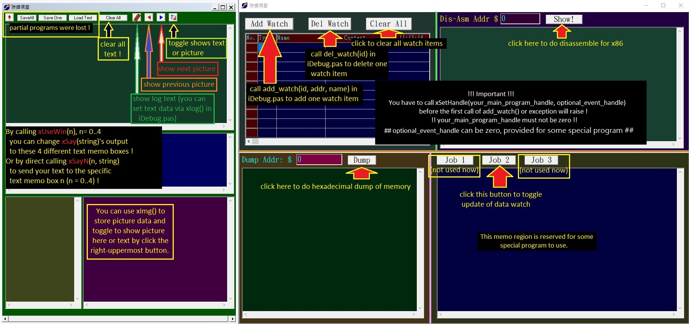
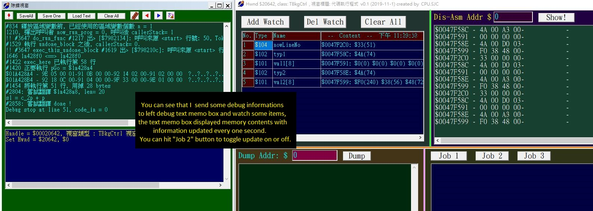
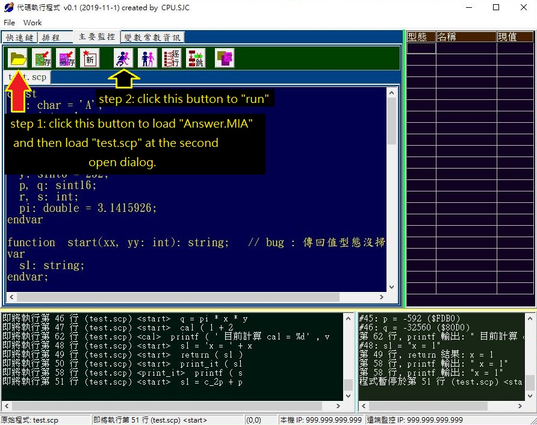
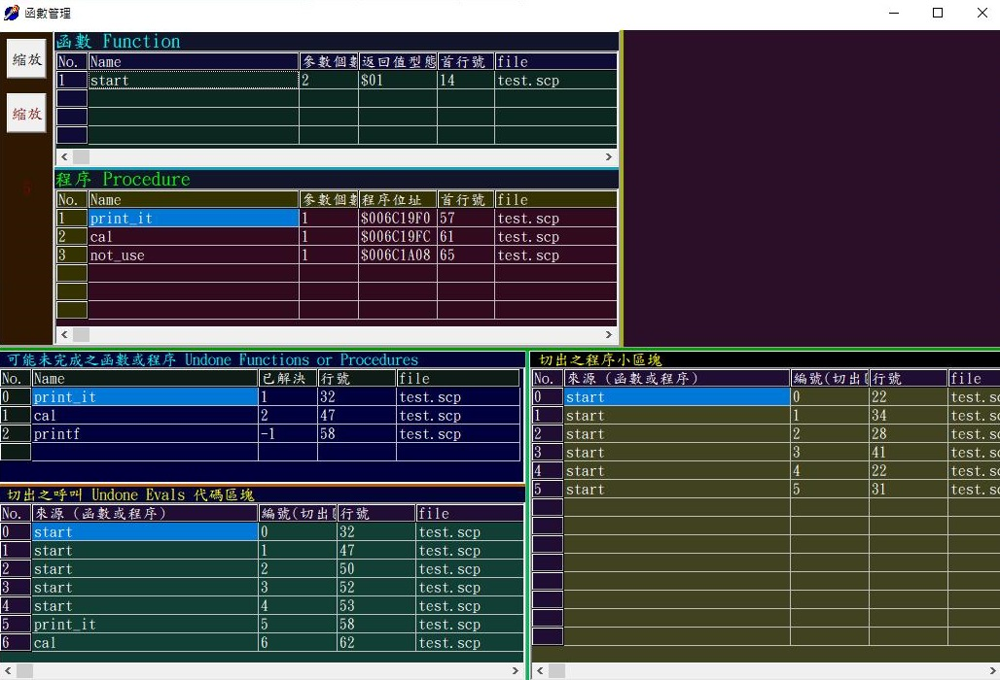
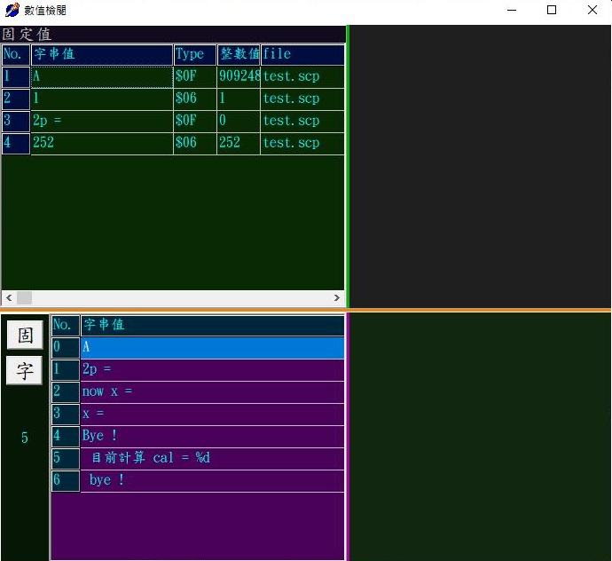

# RunRobot_2019_11
- start from 2019-Nov till 2020-Mar-30

Scan for viruses !
- Execute DebugUse.exe first (to shows more debug informations)
- DebugUse.exe is not compulsory for RunRobot.exe, omit it can let RunRobot runs faster !
  

- Then run RunRobot.exe, open the text file "Answer.MIA" (partial compiled by an earily work)
- Next, open file "test.scp" (the original test source file)
- Cilck the Run button and watch the results.. (If program stopped at some line, hit Run button can keep go on)
- Any time to hit Stop button is also OK to temporary stop running, hit Run button to resume running.

# If you do'nt want to run DebugUse.exe first, it's OK.
# This program has some bugs needs me to fix, sorry !
Thanks a lot !
